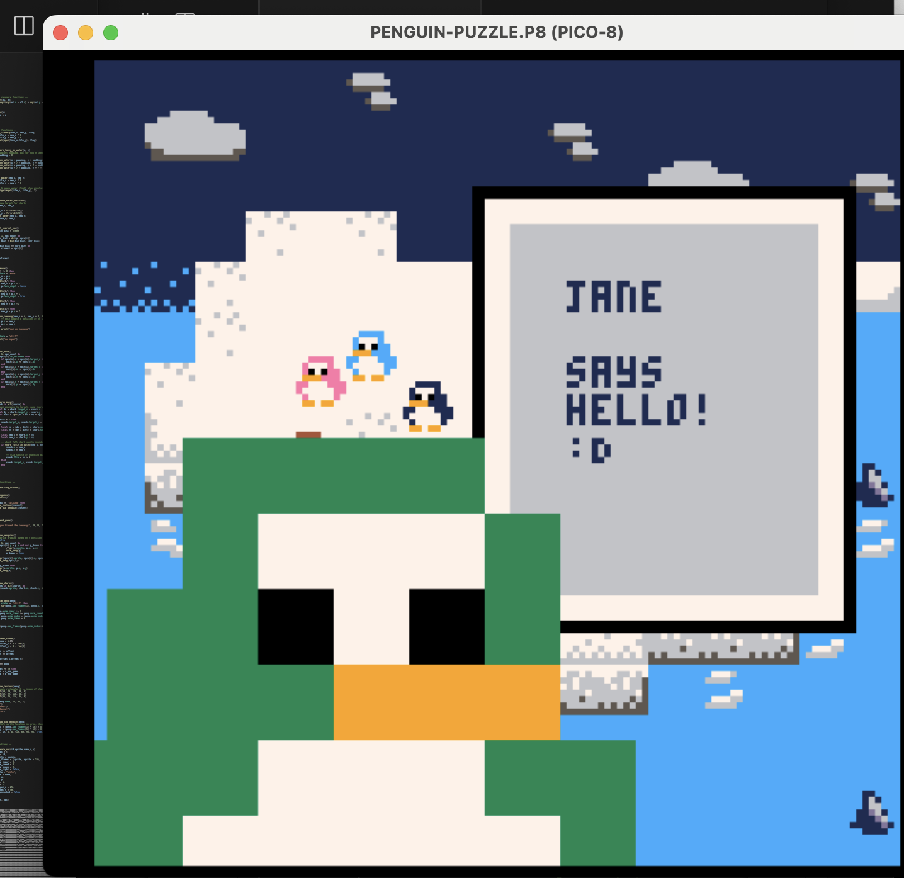
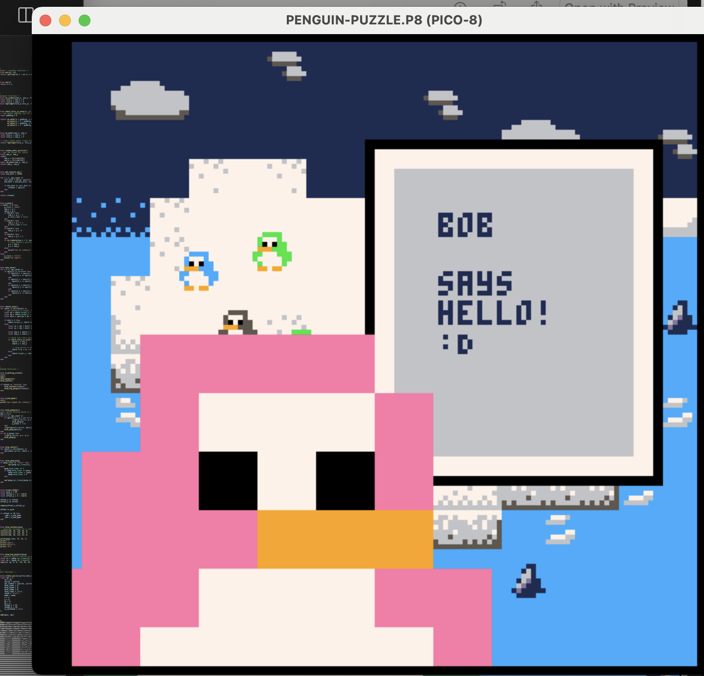
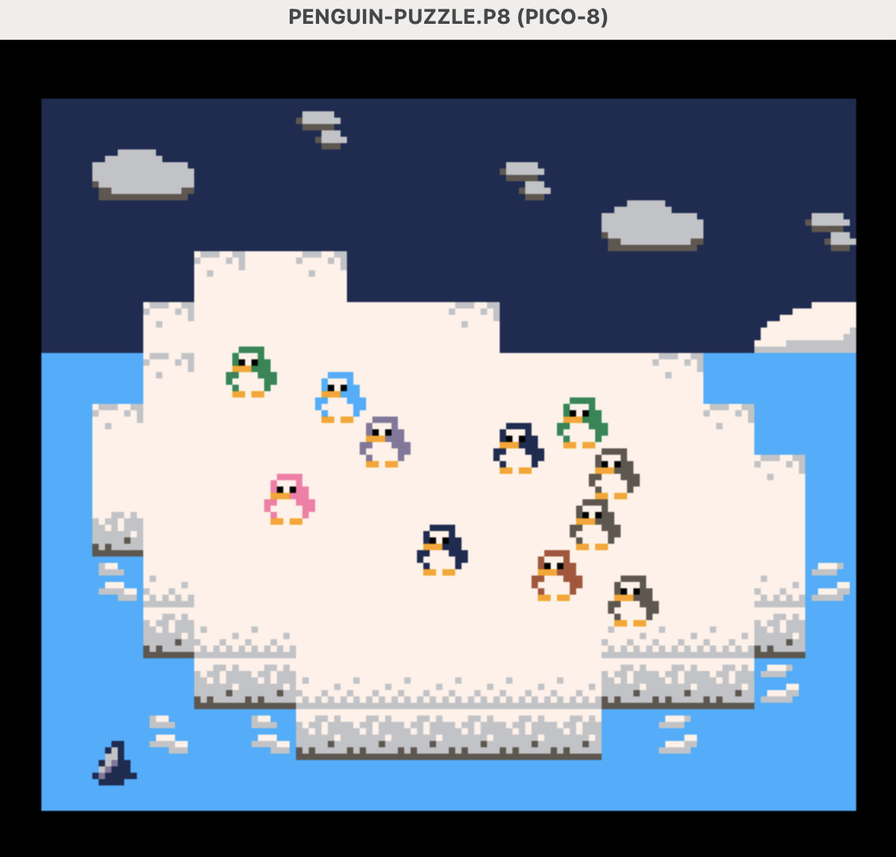

# 🐧🧊 Penguin Puzzle

## Description

Life is good in penguin land :D

## Setup / Running

This project leverages **[pico8-devbuddy](https://github.com/aadriien/pico8-devbuddy)** (creator: **[@aadriien](https://github.com/aadriien)**) to assemble multiple `.lua` files into one single `.p8` file that's PICO-8 friendly, using the command `python3 build_game.py`.

## Example Images

🍀 Hello, Jane!   |   🌸 Hello, Bob! 
:-------------------------:|:-------------------------:
  |   

 

